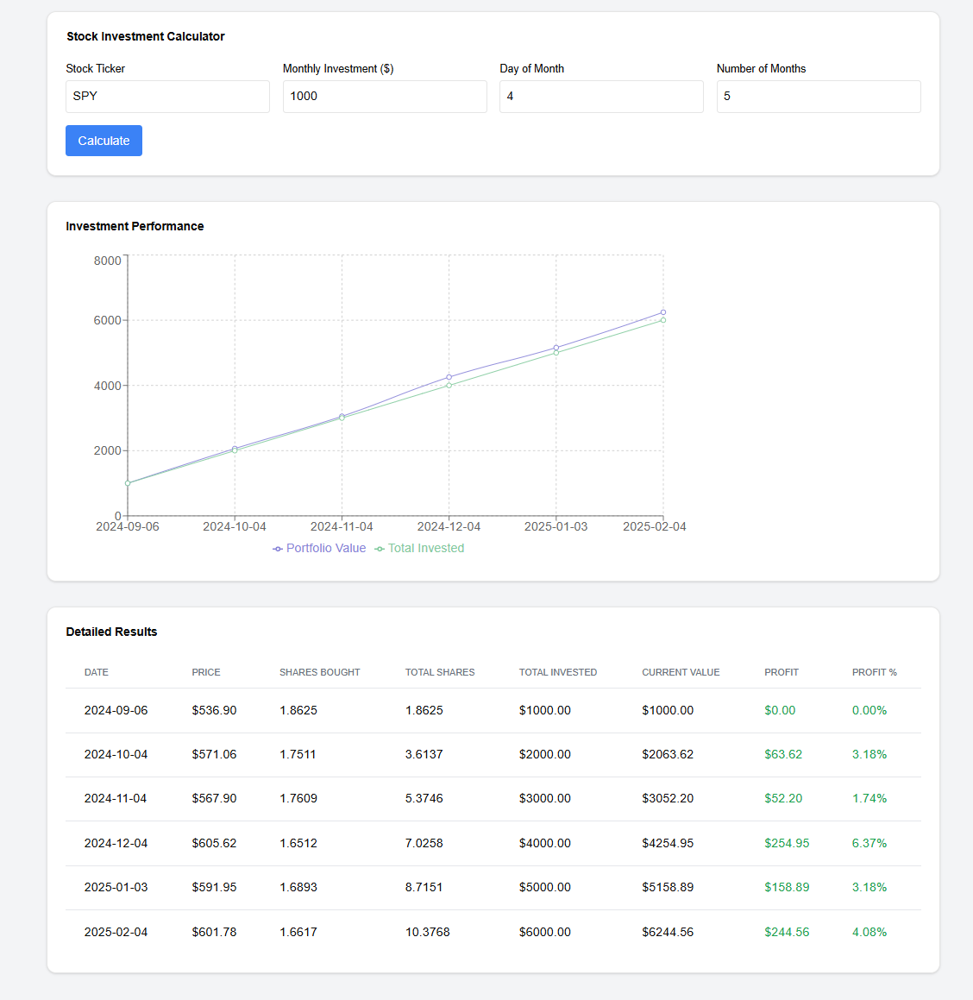
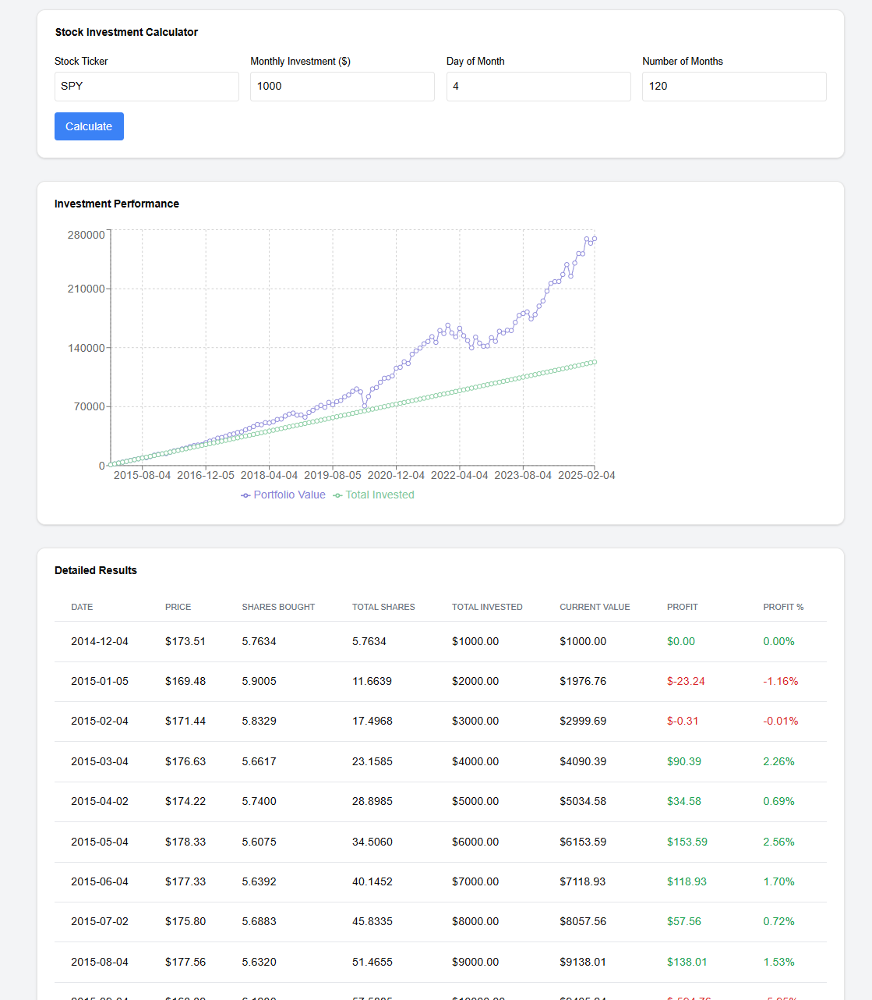

# Stock Investment Tracker

## About

This program graphically demonstrates how much money you could have earned from different stocks over time.  
It's an excellent tool for practicing Dollar Cost Averaging (DCA) and learning more about various stocks.  

*Note: This code was primarily generated by Claude, with some fixes and enhancements.*

## Features

- **Investment Simulation**: Calculate potential earnings based on historical stock data.  
- **Customizable Inputs**: Choose any stock ticker, monthly investment amount, investment day, and investment period.  
- **Visual Representation**: Interactive charts to visualize your investment growth over time.  

## Example

Imagine you work as a programmer and can afford to set aside $1,000 per month to invest in something like the S&P 500. With this tool, you can see how much money you could have accumulated up to today. Just input:  

- **Ticker Symbol**: For example, `SPY` for the S&P 500 ETF.
- **Monthly Investment Amount**: `$1,000`.
- **Investment Day**: The day of the month you plan to invest (e.g., when your salary arrives).
- **Investment Period**: Number of months backward from today.

The program will calculate your potential earnings and display them graphically.  





## Requirements

### Backend

Install the necessary Python packages:

```bash
pip install flask flask-cors yfinance pandas
```

### Frontend

Set up the frontend application and install dependencies:

```bash
# Navigate to the project directory
cd stock-tracker

# Create a new Next.js app with TypeScript and Tailwind CSS
npx create-next-app@latest . --typescript --tailwind --app
```

Install additional dependencies:

```bash
# Charting library and UI components
npm install recharts @radix-ui/react-slot

# Utility libraries for class names
npm install clsx tailwind-merge

# Install shadcn/ui for UI components
npx shadcn@latest init
```

During the `shadcn` initialization, select:

- **Style**: Default
- **Base Color**: Slate
- **CSS Variables**: Yes
- Rest of the options: Default/Yes

Install required components:

```bash
npx shadcn@latest add card
```

## How to Run

### Start the Backend

Navigate to the backend directory and run the Flask application:

```bash
cd backend
python app.py
```

### Start the Frontend

Navigate to the frontend directory and start the development server:

```bash
cd frontend
npm run dev
```

The application should now be running locally. Open your browser and navigate to the provided URL to start exploring your potential investment earnings.

## Contributing

Contributions are welcome! If you'd like to enhance this project, feel free to fork the repository and submit a pull request.

